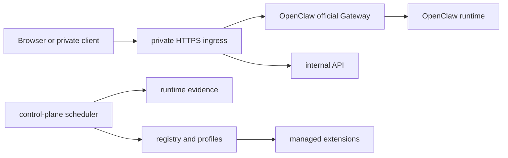

# ClawCTL

当前版本 / Current version: `0.1.0`

许可口径 / License posture: source-available, non-commercial by default. 商业使用、客户交付、SaaS、托管服务、收费集成或经营性部署必须事先取得书面商业授权。This is not an OSI-approved open source license.

ClawCTL 是 OpenClaw 运行基座的控制面与交付治理仓库，用于部署、校验和值守一个私有 OpenClaw runtime boundary：private HTTPS ingress、official Gateway 接入、Python control plane、scheduler、internal API、runtime evidence、release gate 和 managed agent extension 合同。

ClawCTL is a source-available, non-commercial base control plane for deploying and operating an OpenClaw runtime with private ingress, Gateway integration, scheduler automation, internal API checks, release governance, and managed agent extensions.

## What You Can Build / 可落地项

| 场景 / Scenario | ClawCTL 提供什么 / What ClawCTL provides |
|---|---|
| 私有 OpenClaw runtime 边界 / Private runtime boundary | Nginx private HTTPS ingress、Gateway token auth、内网访问控制、证书与入口配置合同 |
| 基座控制面 / Base control plane | `agent_platform` profile、registry validation、scheduler、internal API、runtime path contracts |
| 发布治理 / Release governance | Docker release gate、clean delivery bundle、stack lock verify、第三方声明与非商业许可材料 |
| 扩展开发 / Extension authoring | `agent/extensions/<extension-id>/` 的 managed extension 目录、manifest、env、profile 与 lifecycle 合同 |
| 部署验收 / Deployment acceptance | one-click 部署链、runtime evidence、client access acceptance、diagnostics 与 troubleshooting 文档 |
| 运维接手 / Operations handoff | service status、logs、doctor scripts、maintenance map、security boundary 和 upgrade runbook |

## What It Is Not / 边界说明

- ClawCTL 不内置业务 agent、业务 profile、业务 job、业务模型或业务 listener。
- ClawCTL 不是 SaaS 产品，也不是完整业务解决方案交付包。
- ClawCTL 不是 OSI 意义上的开源项目；默认只授予非商业源码审阅、学习、评估、验证、内部测试与备份权利。
- 商业使用、经营性部署、客户交付、收费服务、托管服务、二开分销和再许可都需要书面商业授权。

## Runtime Shape / 默认运行面

默认 profile 是 `agent_platform`，只启用平台基座能力，不携带业务对象。



默认平台服务对象：

- `openclaw-private-ingress`: 唯一宿主机 HTTPS 入口。
- `openclaw-official-gateway`: OpenClaw runtime 接入与 Gateway token 认证。
- `openclaw-internal-api`: 内部只读控制面 API。
- `openclaw-control-plane-scheduler`: Python 调度器，驱动 evidence、dispatch、diagnostics 与 recovery 表面。

配置真源：

- `config/control_plane/service.json`: base control-plane 内核配置。
- `config/control_plane/profiles/agent_platform.service.json`: 默认平台 profile。
- `config/control_plane/extensions.d/agent_platform.json`: 平台 extension。
- `deploy/docker-compose.yml`: private ingress、Gateway、internal API 与 scheduler 的默认运行编排。

## Quick Start / 快速验证

本地只读验证不需要生产密钥。完整 Docker release gate 需要 Linux Docker 环境。

```bash
python -m openclaw.cli control-plane validate registry --control-plane-profile agent_platform
python -m openclaw.cli control-plane stack verify --json --strict-release
bash ./scripts/testing/check_repo_test_readiness.sh
```

完整发布门禁：

```bash
bash ./scripts/doctor/run_repo_release_gate.sh --json
bash ./scripts/setup/export_clean_delivery_bundle.sh --bundle full-source-governance --check-only
```

安装为 Python editable package 后，可使用两个等价 CLI 名称：

```bash
python -m pip install -e .
openclaw --help
clawctl --help
```

## Repository Map / 仓库地图

| 路径 / Path | 用途 / Purpose |
|---|---|
| `python/openclaw/` | Python control plane、scheduler、internal API、runtime checks、release governance |
| `config/control_plane/` | base service、profile registry、schemas、object policies、platform extension |
| `deploy/` | Docker Compose、Nginx ingress、site env example、TLS helper scripts |
| `agent/` | agent plane governance、managed extension authoring contract |
| `agent/extensions/` | 仓内显式 extension 入口；默认发布面为空索引和基座溯源 |
| `scripts/setup/` | host preparation、one-click deploy、clean delivery bundle |
| `scripts/doctor/` | runtime、governance、release、ingress、image 与 control-plane diagnostics |
| `scripts/testing/` | repository readiness、syntax、unit test entrypoints |
| `docs/` | architecture、getting-started、operations、security boundary、troubleshooting |

## Developer Paths / 开发者入口

- 了解项目目标态和边界：[`VISION.md`](VISION.md)
- 部署主线：[`docs/getting-started/quickstart.md`](docs/getting-started/quickstart.md)
- 支持边界：[`docs/architecture/supported-deployment-boundary.md`](docs/architecture/supported-deployment-boundary.md)
- 控制面基线：[`docs/architecture/control-plane-baseline.md`](docs/architecture/control-plane-baseline.md)
- 平台主路径：[`docs/architecture/platform-main-path.md`](docs/architecture/platform-main-path.md)
- Extension authoring：[`agent/extensions/README.md`](agent/extensions/README.md)
- 运维和值守：[`docs/operations/runtime-service-reference.md`](docs/operations/runtime-service-reference.md)
- 维护地图：[`docs/operations/maintenance-map.md`](docs/operations/maintenance-map.md)
- 安全边界：[`docs/operations/security-boundary.md`](docs/operations/security-boundary.md)
- 排障：[`docs/operations/troubleshooting.md`](docs/operations/troubleshooting.md)
- 脚本索引：[`scripts/README.md`](scripts/README.md)

## Extension Model / 扩展模型

ClawCTL 的默认发布面只包含 `base` 和 `agent_platform`。业务能力通过仓内显式 managed extension 接入，而不是混入基座。

正式 extension 应放在 `agent/extensions/<extension-id>/`，并通过以下入口进入运行面：

- 仓内正式 profile；
- 有效自动发现 profile；
- 指向仓内标准 extension service 的显式 `--config-path`。

仓外非标准 manifest 目录不属于兼容入口。

## Release and Audit / 发布与审计

发布候选必须满足：

- profile registry 只包含基座发布面；
- `agent_platform` registry validation 通过；
- strict stack verify 通过；
- Docker release gate 通过；
- full-source-governance clean bundle check 通过；
- 仓库、archive entry 和全文扫描无业务扩展残留、无真实凭据、无私钥、无证书输出目录；
- `LICENSE`、`NOTICE`、`COMMERCIAL_LICENSE.md`、`THIRD_PARTY_NOTICES.md` 与当前 image pin 同步。

GitHub Actions 中的 Release Gate 会在 `main` push 和 PR 上执行 Docker release gate 与 full-source-governance bundle check。

## License / 许可

ClawCTL 的原创部分适用 [`LICENSE`](LICENSE) 中的非商业源码可见许可。商业使用请先阅读 [`COMMERCIAL_LICENSE.md`](COMMERCIAL_LICENSE.md)。第三方组件、镜像和依赖声明见 [`THIRD_PARTY_NOTICES.md`](THIRD_PARTY_NOTICES.md)，版权与发布状态见 [`NOTICE`](NOTICE)。
