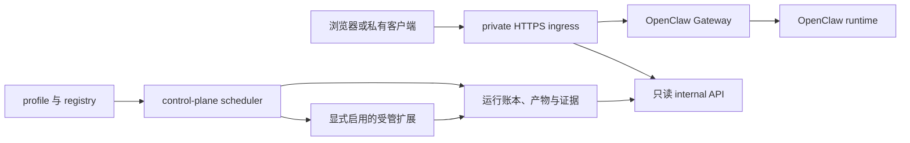

# ClawCTL

## 项目是什么

ClawCTL 帮助技术团队将 OpenClaw 与业务智能体从“能够运行”，推进到可部署、可扩展、可验收、可持续维护。它面向私有部署，把配置、调度、运行验收、故障处理和交付治理连接起来，帮助维护者持续确认系统如何运行、任务是否完成，以及升级后能否接手。

这里的 **OpenClaw** 是执行智能体与会话的运行时；**基座**是围绕该运行时提供部署、调度、状态查询、证据和运维的公共能力；**扩展**是在基座合同内接入具体模块、通道或业务流程的受管包。本公开仓库交付平台基座及其治理资料，不附带业务扩展；接入后的具体业务价值由对应扩展文档说明。

当前实现与正式支持边界以下文和对应合同页为准；长期方向见 [VISION.md](VISION.md)，版本信息以 [pyproject.toml](pyproject.toml) 为准。

## 解决哪些实际困难

智能体能够调用模型或通信渠道后，持续运行仍有五类工作需要处理：

- 部署配置散落在脚本和人工输入中，难以重复部署或确认当前有效配置。
- 模块、模型、通道和权限缺少一致的接入规则，组合能力时容易混淆归属。
- 任务状态与输出产物分离，单次进程成功不能解释任务是否完成。
- 失败现场缺少统一查询和证据，排障、恢复与交接依赖原作者。
- 升级涉及源码、镜像、扩展和依赖，难以核对交付内容与运行组合。

## 基座提供哪些能力

| 实际困难         | 基座能力                                              | 可观察结果                                                 |
|------------------|-------------------------------------------------------|------------------------------------------------------------|
| 部署配置分散     | profile 选择、部署输入校验、配置渲染和阶段化部署      | 能区分人工输入、有效配置和运行状态，按阶段执行和恢复部署   |
| 接入规则缺失     | registry/schema 校验、模块与扩展 owner 合同、依赖装配 | 能核对启用集合、对象来源、权限和依赖，阻断冲突或越界装配   |
| 任务与产物难追踪 | scheduler、运行账本、产物合同和验收证据               | 能回溯任务执行、输出产物与接受结论，区分技术成功和合同接受 |
| 失败难定位       | 服务状态、日志、diagnostics、恢复和值守入口           | 能按健康状态、失败分类和证据选择排查或恢复步骤             |
| 升级交付难验收   | stack lock、release gate 和交付包清单检查             | 能核对版本、来源、依赖和实际文件清单，再进行目标机验收     |

这些是智能体持续运行的公共基础。具体输入、业务决策、外部发送和业务成果由所选扩展定义和验证。

## 如何工作

```mermaid
flowchart LR
    Client["浏览器或私有客户端"] --> Ingress["private HTTPS ingress"]
    Ingress --> Gateway["OpenClaw Gateway"]
    Ingress --> API["只读 internal API"]
    Gateway --> Runtime["OpenClaw runtime"]
    Profile["profile 与 registry"] --> Scheduler["control-plane scheduler"]
    Scheduler --> Extension["显式启用的受管扩展"]
    Scheduler --> Record["运行账本、产物与证据"]
    Extension --> Record
    Record --> API
```

private ingress 提供统一外部入口，Gateway 承接运行时接入与 token 认证。Python control plane 解析 profile 和扩展合同，scheduler 驱动已启用任务；API、运行账本和证据为验收与维护提供观察面。结构合同见 [控制平面基线](docs/architecture/control-plane-baseline.md)，配置、部署和证据之间的关系见 [平台主路径](docs/architecture/platform-main-path.md)。

## 当前支持与边界

- 默认运行 profile 为 `agent_platform`，只启用平台能力；仓内扩展通过正式 profile、有效自动发现 profile 或仓内合同 service 的显式 `--config-path` 接入。
- 默认服务为 private ingress、official Gateway、internal API 和 control-plane scheduler；受支持执行环境以 [支持边界](docs/architecture/supported-deployment-boundary.md) 为准。
- 经 ingress 暴露的 internal API 为 GET 只读查询面；写操作由正式 CLI、部署流程或扩展合同承接。
- 基座负责公共装配、调度、隔离、诊断和证据机制。扩展负责自身业务合同、模型与 provider 依赖、业务配置及业务验收。
- 仓库可托管受管扩展，目录存在不会自动启用；具体能力和组合入口见 [扩展目录](agent/extensions/README.md)。
- 仓库测试不能替代目标机服务、外部投递和业务闭环验收。网络、凭据与运行权限要求见 [安全边界](docs/operations/security-boundary.md)。

## 从哪里开始

| 任务     | 阅读入口                                                                                                                                                               |
|----------|------------------------------------------------------------------------------------------------------------------------------------------------------------------------|
| 技术评估 | [新维护者最小理解路径](docs/architecture/maintainer-minimal-path.md)、[支持边界](docs/architecture/supported-deployment-boundary.md)                                   |
| 首次部署 | [快速开始](docs/getting-started/quickstart.md)、[部署输入](docs/getting-started/deployment-inputs.md)、[宿主机准备](docs/getting-started/environment-setup.md)         |
| 扩展开发 | [Agent 治理目录](agent/README.md)、[扩展挂载合同](docs/architecture/explicit-extension-packages.md)、[配置目录](config/control_plane/README.md)                        |
| 运行维护 | [服务与验收](docs/operations/runtime-service-reference.md)、[运行产物参考](docs/operations/runtime-artifacts-reference.md)、[排障](docs/operations/troubleshooting.md) |
| 项目维护 | [维护事实总览](docs/operations/maintenance-map.md)、[Stack 升级手册](docs/operations/stack-upgrade-runbook.md)、[脚本索引](scripts/README.md)                          |

完整任务导航见 [docs/README.md](docs/README.md)。部署步骤和验证命令由对应任务页统一维护。正式 Python 命令通过控制面容器执行；仓库结构验证可使用不含生产凭据的配置，完整 release gate 需要 Linux Docker 环境。

## 交付材料如何选择

交付内容由 [bundle manifest](config/governance/release/bundle_manifest.json) 的实际清单决定。默认运行 profile 与源码交付范围分别由运行配置和包清单确定。

| 交付包                   | 用途                           | 包含内容                                                                             | 配套要求                                                                               |
|--------------------------|--------------------------------|--------------------------------------------------------------------------------------|----------------------------------------------------------------------------------------|
| `runtime-core`           | 部署已完成准备的精简运行主链路 | 运行配置、control plane 与最小 runtime 脚本；裁剪 docs、setup、doctor 和开发治理资料 | 首次准备、配置和维护使用完整仓库源码或正式完整源码治理包；接入扩展时另备源码与匹配依赖 |
| `ops-toolkit`            | 安装、运维、排障和治理检查     | 安装与诊断工具、治理资产和运维文档；裁剪 getting-started 与 architecture 文档        | 配套完整仓库源码或正式完整源码治理包中的部署与架构资料                                 |
| `full-source-governance` | 完整基座源码、文档和治理交付   | 基座源码、文档、配置与工具，不附带业务扩展                                           | 镜像与访问条件按部署资料准备；部署输入和凭据在目标机维护                               |

导出前核对所选包的文件清单、锁定版本和配置闭合；目标机仍需按 [快速开始](docs/getting-started/quickstart.md) 与 [运行验收](docs/operations/runtime-service-reference.md) 完成部署检查。

## 许可与第三方材料

ClawCTL 的原创部分适用 [LICENSE](LICENSE) 中的非商业源码可见许可（source-available），该许可不是 OSI 批准的开源许可证。商业使用、客户交付、SaaS、托管服务和收费集成需要事先取得书面授权，详见 [商业许可](COMMERCIAL_LICENSE.md)。第三方组件和依赖声明见 [THIRD_PARTY_NOTICES.md](THIRD_PARTY_NOTICES.md)，版权与发布状态见 [NOTICE](NOTICE)。
