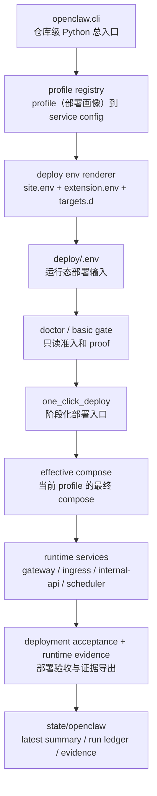
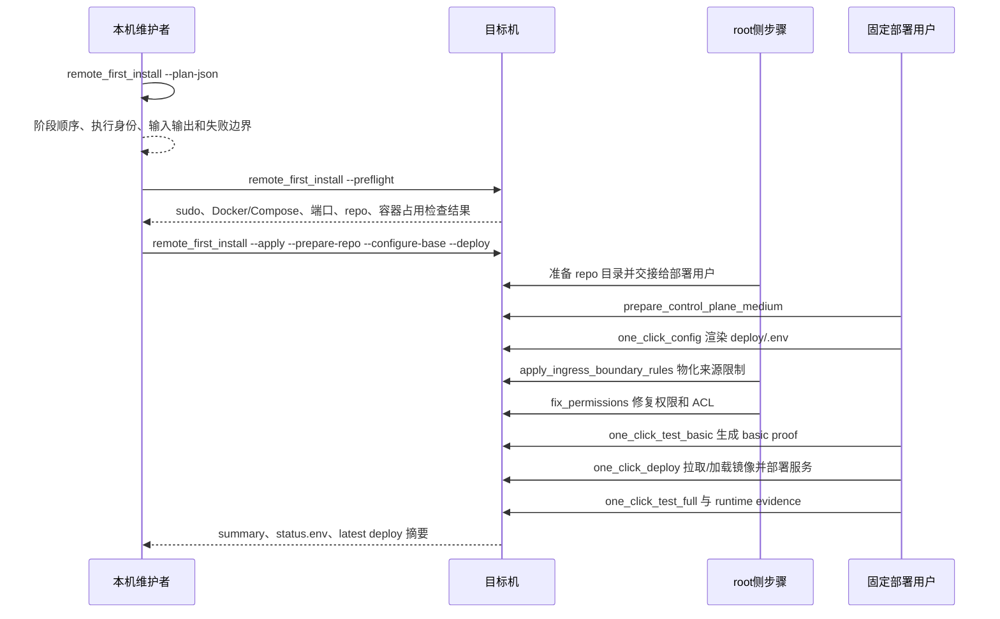

# OpenClaw 平台主路径架构

本页面向首次接触仓库的新维护者，解释平台控制面、部署脚本、配置真源、运行态 state 与生成文档之间的关系。具体部署命令仍以 [`../getting-started/quickstart.md`](../getting-started/quickstart.md) 为准。

## 分层职责

- CLI 入口：`openclaw.cli` 是仓库级 Python 命令总入口，宿主机正式调用统一通过 `scripts/runtime/run_openclaw_python_tool.sh` 进入控制面容器。
- 控制面配置：`config/control_plane/profile_registry.tsv` 把 profile（部署画像）映射到 service config；`agent_platform` 是平台默认 profile，业务扩展 profile 只在显式启用时进入。
- 部署输入：`deploy/site.env`、扩展内部 `agent/extensions/<id>/deploy/extension.env` 与 `deploy/targets.d/*.env` 是人工输入；`deploy/.env` 是 `one_click_config.sh` 渲染出的运行态输入。
- 部署脚本：`scripts/setup` 串起宿主机准备、控制面介质准备、权限修复、basic gate、compose 部署、deployment acceptance 与 runtime evidence 导出。
- 共享合同：`scripts/lib/cidr_contract.sh` 统一来源 CIDR 列表、私网/loopback 和 allowlist 覆盖判断；远程首装与访问端验收不得各自维护 CIDR 规则。
- 验证层级：`config/governance/support/verification_tiers.json` 区分正式 Docker / 控制面容器门禁与 Windows 宿主机诊断回归；诊断回归不得替代正式 release pass。
- 镜像治理：`scripts/images` 和 `config/runtime/source_strategy.json` 共同定义运行镜像角色；Gateway candidate 只改当前 `deploy/.env`，canonical pin 仍在 pin 真源。
- 运行态状态：`state/openclaw` 存放控制面 summary、proof、run ledger、evidence 和 effective compose；这些文件是运行结果，不作为手工配置真源。
- 治理基线：平台 Python docstring 默认基线位于 `config/governance/validation/platform_python_docstring_baseline/` 分片目录；report 模式按相对基线新增退化缺口与高优先模块缺口分组。
- 文档真源：`config/governance/docs/*.json`、`config/governance/flows/*.json`、`config/governance/support/*.json` 和渲染器共同生成部分文档；遇到生成文档漂移时先修真源，再同步生成物。

## 主链路

## 远程首装时序

## 维护原则

- 先找真源：profile、stage flow、script catalog、docs surface 和 runtime path 都有配置真源，不直接把派生文档当唯一修改点。
- 先过只读门禁：宿主机 readiness、basic gate、image readiness 和 ingress evidence 都是进入下一步前的边界。
- 不混用权限角色：root 侧只做宿主机准备、边界规则和权限修复动作；`one_click_config`、basic gate、部署主链由固定部署用户执行。
- 部署用户有显式证据：`prepare_deploy_user.sh` 写入 `.openclaw/deploy-user.marker`，记录部署用户是否由 OpenClaw 创建；远程清理只把 `created_by_openclaw=1` 的部署用户纳入删除计划。
- 不把 candidate 当 canonical：镜像候选源只证明当前部署可达性，正式 pin 仍通过供应链治理入口更新。
- 远程清理默认只读：`cleanup_remote_openclaw.sh` 默认只输出计划；显式 `--apply` 也只删除带 OpenClaw 证据的容器、网络、卷、容器关联镜像、目录、用户和边界规则。
- 注释按公共接口治理：模块、类、公共函数和高风险私有函数必须说明参数、返回、失败条件和副作用；小型局部 helper 不强行写无信息量注释。
