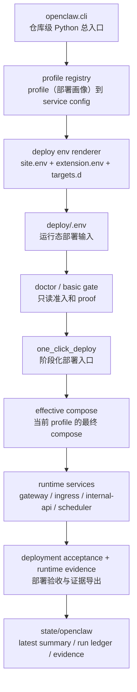
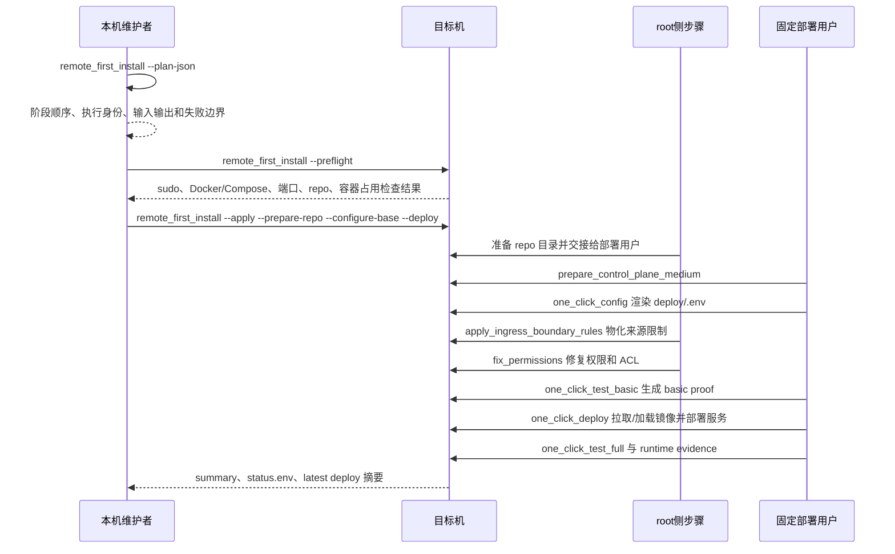

# OpenClaw 平台主路径架构

本页面向首次接触仓库的新维护者，解释平台控制面、部署脚本、配置真源、运行态 state 与生成文档之间的关系。具体部署命令仍以 [`../getting-started/quickstart.md`](../getting-started/quickstart.md) 为准。

## 分层职责

- CLI 入口：`openclaw.cli` 是仓库级 Python 命令总入口，宿主机正式调用统一通过 `scripts/runtime/run_openclaw_python_tool.sh` 进入控制面容器。
- 控制面配置：`config/control_plane/profile_registry.tsv` 把 profile（部署画像）映射到 service config；`agent_platform` 是平台默认 profile，业务扩展 profile 只在显式启用时进入。
- 部署输入：`deploy/site.env`、扩展内部 `agent/extensions/<id>/deploy/extension.env` 与 `deploy/targets.d/*.env` 是人工输入；`deploy/.env` 是 `one_click_config.sh` 渲染出的运行态输入。
- 部署脚本：`scripts/setup` 串起宿主机准备、控制面介质准备、权限修复、basic gate、compose 部署、deployment acceptance 与 runtime evidence 导出。
- 共享合同：`scripts/lib/cidr_contract.sh` 统一来源 CIDR 列表、ingress 来源合法性和 allowlist 覆盖判断；远程首装与访问端验收不得各自维护 CIDR 规则。
- 验证层级：`config/governance/support/verification_tiers.json` 区分正式 Docker / 控制面容器门禁与宿主机静态前置检查；前置检查不得执行仓库 Python，也不得替代正式 release pass。
- 镜像治理：`scripts/images` 和 `config/runtime/source_strategy.json` 共同定义运行镜像角色；Gateway candidate 仅切换当前 `deploy/.env` 的 Gateway 镜像引用，canonical pin 仍在 pin 真源；在线拉取完成后默认清理未被当前部署选用的 Gateway 来源标签。
- 运行态状态：`state/openclaw` 存放控制面 summary、proof、run ledger、evidence 和 effective compose；这些文件是运行结果，不作为手工配置真源。
- 治理基线：平台 Python docstring 递进基线位于 `config/governance/validation/platform_python_docstring_baseline/` 分片目录；仓库生产语义 docstring 基线位于 `config/governance/validation/repo_prod_semantic_docstring_baseline/` 分片目录。release gate 使用 `repo-prod ratchet` 阻断新增或退化语义缺口，`enforce` 是人工零缺口收口模式。
- 文档真源：`config/governance/docs/*.json`、`config/governance/flows/*.json`、`config/governance/support/*.json` 和渲染器共同生成部分文档；遇到生成文档漂移时先修真源，再同步生成物。

## 测试与发布验证职责

测试体系只保留四类职责：

1. unit 验证公共行为、错误边界和安全不变量。`scripts/testing/run_repo_unittest.sh` 默认仅在父进程枚举真实 `test_*.py` 文件，排除扩展聚合入口，由 worker 加载和执行；`--list-tests --json` 提供确定性测试 ID，`--report-json <path>` 记录测试、模块、worker、耗时、退出状态与总耗时。worker 和完整 suite 的默认内层时限分别为 300 秒和 900 秒。
2. 结构契约验证 registry、schema、所有权、文档导航和实现引用闭合。永久门禁必须对应可复现的结构故障，不以历史路径、措辞或测试源码写法作为全仓黑名单。
3. 隔离集成验证需要写入或生命周期变更的流程。agent 模块生命周期矩阵在一个仓库副本中依次验证 scaffold、attach、detach、prune、drop、失败回滚和 registry 闭合，默认时限为 300 秒。
4. 部署运行验收验证目标机服务、投递与证据；它不由仓库 unit 或静态门禁代替，也不会在仓库测试治理中触发真实投递。

`run_repo_release_gate.sh` 提供 `static`、`integration`、`exhaustive` 三个 lane；选择多个 lane 或不指定 `--lane` 时并发执行，lane 内仍保持声明顺序，报告总耗时采用真实墙钟时间。静态检查默认时限为 120 秒，批量 import closure 为 240 秒，正式 release 仍在 `exhaustive` lane 对所有非测试模块执行独立冷启动；`openclaw.tests` 由 repo unittest 真实加载，不重复启动进程。长检查每 30 秒只向 stderr 输出心跳，JSON stdout 保持可直接解析。

## 主链路

```mermaid
flowchart TD
  A["openclaw.cli<br/>仓库级 Python 总入口"] --> B["profile registry<br/>profile（部署画像）到 service config"]
  B --> C["deploy env renderer<br/>site.env + extension.env + targets.d"]
  C --> D["deploy/.env<br/>运行态部署输入"]
  D --> E["doctor / basic gate<br/>只读准入和 proof"]
  E --> F["one_click_deploy<br/>阶段化部署入口"]
  F --> G["effective compose<br/>当前 profile 的最终 compose"]
  G --> H["runtime services<br/>gateway / ingress / internal-api / scheduler"]
  H --> I["deployment acceptance + runtime evidence<br/>部署验收与证据导出"]
  I --> J["state/openclaw<br/>latest summary / run ledger / evidence"]
```

## 远程首装时序

```mermaid
sequenceDiagram
  participant Local as 本机维护者
  participant Remote as 目标机
  participant Root as root侧步骤
  participant User as 固定部署用户
  Local->>Local: remote_first_install --plan-json
  Local-->>Local: 阶段顺序、执行身份、输入输出和失败边界
  Local->>Remote: remote_first_install --preflight
  Remote-->>Local: sudo、Docker/Compose、端口、repo、容器占用检查结果
  Local->>Remote: remote_first_install --apply --prepare-repo --configure-base --deploy
  Root->>Remote: 准备 repo 目录并交接给部署用户
  User->>Remote: prepare_control_plane_medium
  User->>Remote: one_click_config 渲染 deploy/.env
  Root->>Remote: apply_ingress_boundary_rules 物化来源限制
  Root->>Remote: fix_permissions 修复权限和 ACL
  User->>Remote: one_click_test_basic 生成 basic proof
  User->>Remote: one_click_deploy 拉取/加载镜像并部署服务
  User->>Remote: one_click_test_full 与 runtime evidence
  Remote-->>Local: summary、status.env、latest deploy 摘要
```

## 维护原则

- 先找真源：profile、stage flow、script catalog、docs surface 和 runtime path 都有配置真源，不直接把派生文档当唯一修改点。
- 先过只读门禁：宿主机 readiness、basic gate、image readiness 和 ingress evidence 都是进入下一步前的边界。
- 不混用权限角色：root 侧只做宿主机准备、边界规则和权限修复动作；`one_click_config`、basic gate、部署主链由固定部署用户执行。
- 部署用户有显式证据：`prepare_deploy_user.sh` 写入 `.openclaw/deploy-user.marker`，记录部署用户是否由 OpenClaw 创建；远程清理只把 `created_by_openclaw=1` 的部署用户纳入删除计划。
- 不把 candidate 当 canonical：镜像候选源只证明当前部署可达性，正式 pin 仍通过供应链治理入口更新。
- 远程清理默认只读：`cleanup_remote_openclaw.sh` 默认只输出计划；显式 `--apply` 也只删除带 OpenClaw 证据的容器、网络、卷、容器关联镜像、目录、用户和边界规则。
- 注释按生产语义治理：模块、类、公共函数、公共方法和高风险私有函数必须使用中文说明职责、逐参数含义、已标注参数类型、返回含义、返回类型、异常和副作用；关键 shell 函数使用 `# 职责：` 注释说明输入、输出和副作用边界；小型局部 helper 不强行写无信息量注释。
- 测试按故障治理：保留恶意输入、失败恢复、幂等性、路径与凭据安全行为；实现片段、函数名、帮助措辞和历史路径不得成为永久门禁。
